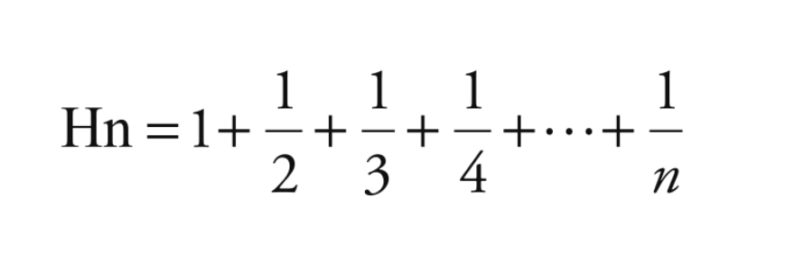
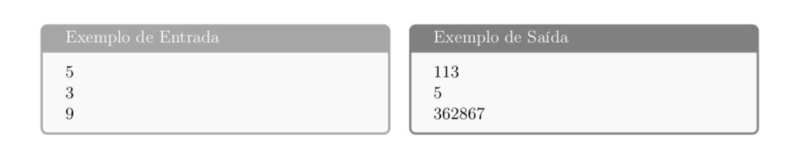

  <h1> LISTA DE EXERCÍCIOS 01 – UNIDADE 1 </h1>

Nome do aluno: Silas Eduardo Rodrigues dos Santos
Matricula: 20210081921

**Questão 1)** Implemente uma função recursiva que calcule a soma dos primeiros n cubos:

S = 13 + 23 + ... + n3

**Questão 2)** Implemente uma função recursiva que retorne o menor elemento em um vetor.
 

**Questão 3)** Em matemática, o número harmônico designado por Hn define-se como o enésimo termo
da série harmônica. Implemente uma função recursiva que calcule o valor de qualquer
Hn. Ou seja:
  

  

 

**Questão 4)** Implemente uma função recursiva que determine quantas vezes um dígito d ocorre em
um número natural K. Por exemplo, o dígito 6 ocorre 2 vezes em 362867
 

**Questão 5)** Implemente uma função que lê um valor inteiro e retorna o maior número primo inteiro
anterior ao valor do fatorial desse número. Você deverá obedecer aos seguintes detalhes
de implementação:
 
- O valor do número inteiro deve ser lido através da linha de comando.
 
- Implemente o seu programa de forma modular. 
 
- Crie o conjunto de arquivos fatorial.h/.cpp (com a implementação da função de fatorial),
primalidade.h/.cpp (com a implementação das funções que testam a primalidade de um valor
inteiro e que retorna o maior primo inteiro anterior a X) e um arquivo main.c (contendo o
programa principal). 
 
- Crie um makefile para a compilação e geração do binário/executável.
 
- Utilize conceitos de recursividade para o cálculo do fatorial e para a obtenção do maior
número primo anterior ao valor do fatorial do número em questão.
 
- Por exemplo, se X = 3, temos que fatorial de 3 = 6, logo o maior número inteiro primo anterior
a X! é 5. Se X = 5, temos que 5! = 120, logo o maior número inteiro primo anterior ao fatorial
de X é 113. Se X = 5, temos que X! = 362880, logo o maior número inteiro primo anterior a X é
362867
 
  

  

